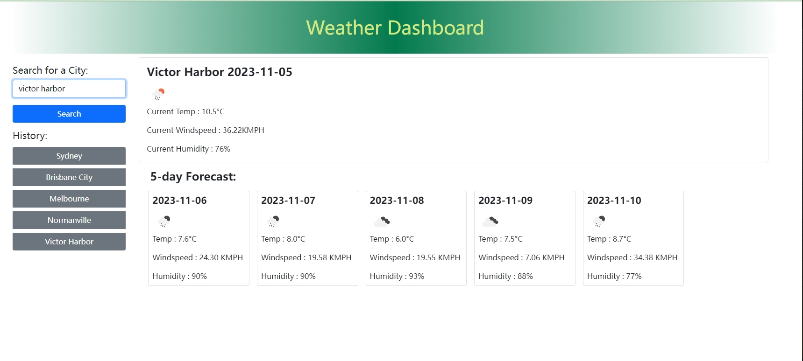

# weatherDashboard

## Description

weather dashboard shows the current and future weather of a city that the user searched for.
- user can type in a city that he/she is interested in to see the current weather and future weather.
- when searched a valid city, a box shows the current legal city name, current date, weather condition icon, temperature, windspeed & humidity.
- when searched a valid city, 5 days weather forecast is listed in the 5-day forecast section, with date, weather condition icon, temperature, windspeed & humidity information.
- after a city searched, a searched history section appear under the search bar, allowing to store 5 search histories at most, when new search submitted, the oldest history get kicked out from the list.
- when clicking on the searched history, the weather information of that city appears in the current weather and the 5-days forecast sections.

## Illustration

open and view the contents on https://mkdkck.github.io/weatherDashboard/

search the city that you are interested in:

when entry empty city, warning dialog appear:

allowing 5 histories to be stored:

history presists even the page reflashed:

HTML, CSS & JS codes can be examined on https://github.com/mkdkck/weatherDashboard

## Usage

- open the link to see a fully fucntional website.
- type the city in the search bar to show the current weather and future 5 days weather info.
- click the history buttons to show the weather detail of the city that you searched before.

## License

N/A

## Badges

